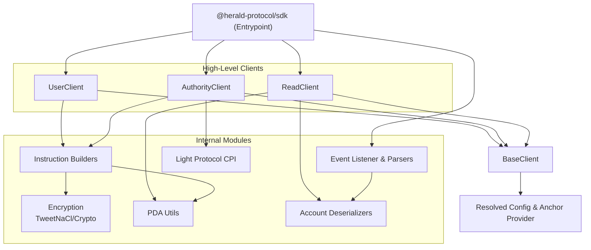
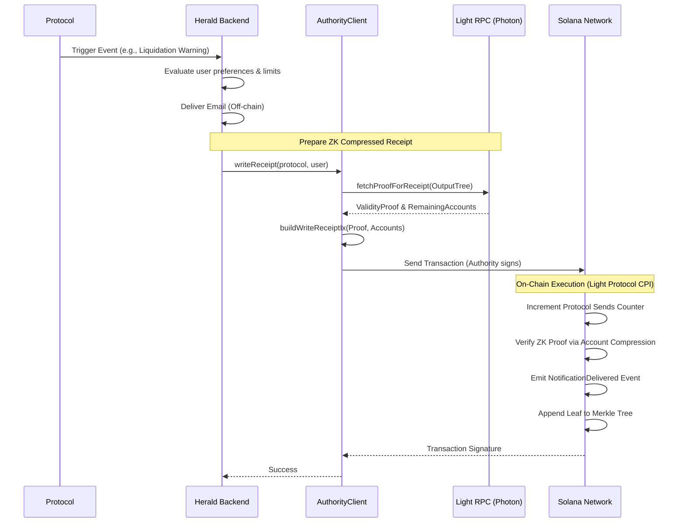
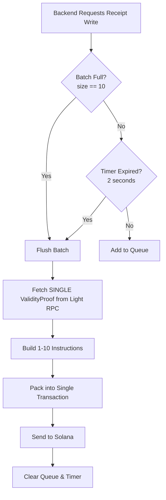
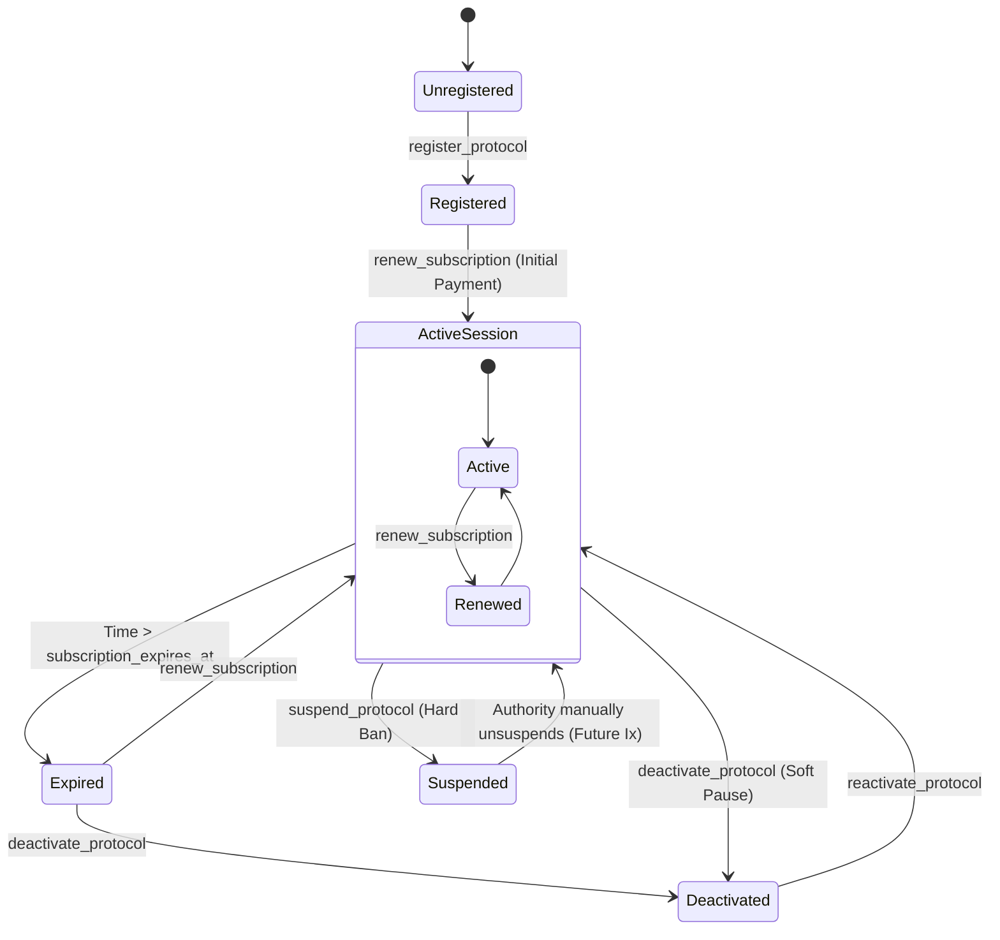

# Herald SDK Architecture & Flows

This document details the internal architecture of the `@herald-protocol/sdk` and outlines the key user and system flows using Mermaid diagrams.

## 1. SDK Component Architecture

The SDK is organized modularly. The base layer handles Anchor interactions and deserialization, while the high-level clients provide interfaces for distinct user personas (Users, Authorities, Readers).

## 2. Identity Registration Flow

This flow illustrates how an end-user registers their email address on-chain without exposing the plaintext email. The encryption happens entirely client-side.

```mermaid
sequenceDiagram
    participant User as End User (Wallet)
    participant SDK as @herald-protocol/sdk
    participant Solana as Solana Network

    User->>SDK: registerIdentity("alice@example.com")
    
    rect rgb(30, 40, 60)
        Note over SDK: Client-Side Encryption
        SDK->>SDK: hashEmail("alice@example.com") -> emailHash
        SDK->>SDK: deriveX25519(User_Ed25519_Key)
        SDK->>SDK: generateEphemeralKeypair()
        SDK->>SDK: encrypt("alice@example.com") -> encryptedEmail + nonce
    end

    SDK->>SDK: findIdentityPda(User.publicKey)
    SDK->>SDK: buildRegisterIdentityIx(...)
    SDK->>Solana: Send Transaction (Instruction)
    
    Solana-->>SDK: Transaction Signature
    
    rect rgb(30, 60, 40)
        Note over Solana: On-Chain Execution
        Solana->>Solana: Initialize Identity PDA
        Solana->>Solana: Store encryptedEmail, emailHash, nonce
        Solana->>Solana: Emit IdentityRegistered Event
    end

    SDK-->>User: Success (Tx Signature)
```

## 3. Notification Delivery & Write Receipt Flow

When a protocol triggers a notification, the Herald Backend uses the SDK to compress the delivery receipt using Light Protocol, saving significant rent costs.

## 4. Receipt Batching Flow

To amortise the fixed costs of Solana transactions and ZK verification, the SDK includes a `ReceiptBatchProcessor` that groups multiple receipt writes into a single transaction.

## 5. Protocol Lifecycle State Machine

Protocols have subscriptions and tiers. The on-chain state restricts sending capabilities based on these states.

These diagrams should provide a clear mental model of how data and control flows through the Herald Privacy Registry SDK and the corresponding Solana program.
